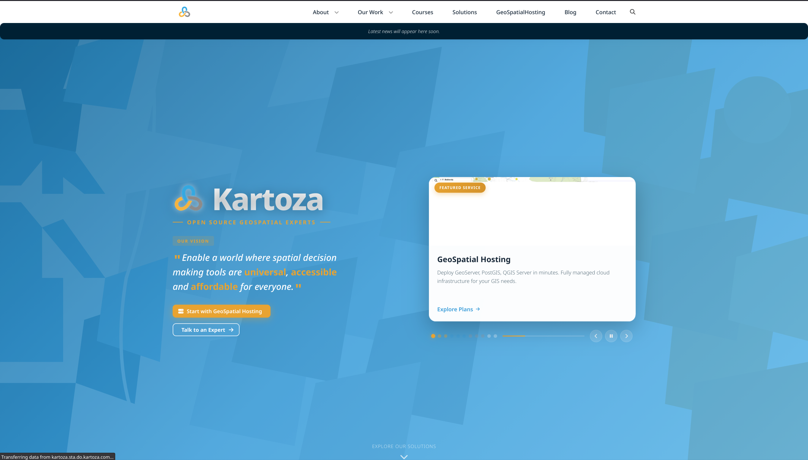

<p align="center">
  <a href="https://kartoza.com">
    
  </a>
</p>

<h1 align="center">Kartoza Website</h1>

<p align="center">
  <strong>A Happy Life is a Mappy Life</strong>
</p>

<p align="center">
  <em>Official website for <a href="https://kartoza.com">Kartoza</a> - Open Source Geospatial Experts</em>
</p>

<p align="center">
  <a href="https://kartoza.com">
    
  </a>
</p>

---

<p align="center">
  
</p>

---

## Table of Contents

- [Table of Contents](#table-of-contents)
- [About Kartoza](#about-kartoza)
  - [Our Vision](#our-vision)
  - [What We Do](#what-we-do)
- [Technology Stack](#technology-stack)
- [Prerequisites](#prerequisites)
- [Quick Start](#quick-start)
  - [Using Nix (Recommended)](#using-nix-recommended)
  - [Using Docker](#using-docker)
  - [Manual Setup](#manual-setup)
- [Project Structure](#project-structure)
- [Content Management](#content-management)
  - [Adding Content](#adding-content)
  - [Front Matter Example](#front-matter-example)
  - [Images](#images)
- [Development](#development)
  - [Available Commands](#available-commands)
  - [CI/CD Workflows](#cicd-workflows)
- [Security](#security)
- [Contributing](#contributing)
  - [Code Style](#code-style)
- [License](#license)
- [Contact](#contact)
- [Acknowledgements](#acknowledgements)

---

<p align="center">
  <!-- CI/CD Status -->
  <a href="https://github.com/kartoza/kartoza-website/actions/workflows/github-pages.yml">
    
  </a>
  <a href="https://github.com/kartoza/kartoza-website/actions/workflows/nix-build.yml">
    
  </a>
  <a href="https://github.com/kartoza/kartoza-website/actions/workflows/playwright-e2e.yml">
    
  </a>
  <a href="https://github.com/kartoza/kartoza-website/actions/workflows/pr-checks.yml">
    
  </a>
</p>

<p align="center">
  <!-- Version & Release -->
  <a href="https://github.com/kartoza/kartoza-website/releases/latest">
    
  </a>
  <a href="https://github.com/kartoza/kartoza-website/releases">
    
  </a>
  <a href="https://github.com/kartoza/kartoza-website">
    
  </a>
</p>

<p align="center">
  <!-- Tech Stack -->
  
  
  
  
</p>

<p align="center">
  <!-- Project Health -->
  <a href="https://github.com/kartoza/kartoza-website/blob/main/LICENSE">
    
  </a>
  <a href="https://github.com/kartoza/kartoza-website/commits/main">
    
  </a>
  <a href="https://github.com/kartoza/kartoza-website/graphs/commit-activity">
    
  </a>
  <a href="https://github.com/kartoza/kartoza-website/graphs/contributors">
    
  </a>
</p>

<p align="center">
  <!-- Issues & PRs -->
  <a href="https://github.com/kartoza/kartoza-website/issues">
    
  </a>
  <a href="https://github.com/kartoza/kartoza-website/issues?q=is%3Aissue+is%3Aclosed">
    
  </a>
  <a href="https://github.com/kartoza/kartoza-website/pulls">
    
  </a>
  <a href="https://github.com/kartoza/kartoza-website/pulls?q=is%3Apr+is%3Aclosed">
    
  </a>
</p>

<p align="center">
  <!-- Community -->
  <a href="https://github.com/kartoza/kartoza-website/stargazers">
    
  </a>
  <a href="https://github.com/kartoza/kartoza-website/network/members">
    
  </a>
  <a href="https://github.com/kartoza/kartoza-website/watchers">
    
  </a>
</p>

<p align="center">
  <!-- Security & Quality -->
  <a href="https://github.com/kartoza/kartoza-website/security/dependabot">
    
  </a>
  
  
  
</p>

<p align="center">
  <!-- Infrastructure -->
  
  
  <a href="https://github.com/kartoza/kartoza-website/blob/main/flake.nix">
    
  </a>
</p>

---

## About Kartoza


**Kartoza** is a global Free and Open Source GIS (FOSS GIS) service provider registered in South Africa and Portugal. We use GIS software to address location-related challenges for individuals, businesses, and governments worldwide.

### Our Vision

> Enable a world where spatial decision making tools are **universal**, **accessible** and **affordable** for everyone for the benefit of the planet and people.

### What We Do

- Custom GIS software development
- Geospatial data management & analysis
- Training & capacity building
- Support & maintenance for open source GIS

---

## Technology Stack

| Category | Technology |
|----------|------------|
| **Static Site Generator** | [Hugo](https://gohugo.io/) (Extended) |
| **CSS Framework** | [Bulma](https://bulma.io/) |
| **Theme** | Custom `hugo-bulma-blocks-theme` |
| **Development Environment** | [Nix Flakes](https://nixos.wiki/wiki/Flakes) |
| **Container Runtime** | Docker + nginx |
| **CI/CD** | GitHub Actions |
| **Testing** | Playwright E2E |

---

## Prerequisites

| Requirement | Version | Notes |
|-------------|---------|-------|
| **Hugo** | 0.147+ | Extended version required |
| **Nix** | 2.4+ | Optional, but recommended |
| **Docker** | 20.10+ | Optional, for containerized deployment |

> **Note**: Using Nix Flakes automatically provides all dependencies. No manual installation required.

---

## Quick Start

### Using Nix (Recommended)

```bash
# Enter the development environment
nix develop

# Start the development server
hugo server
```

### Using Docker

```bash
# Build and run with Docker Compose
docker-compose up --build
```

### Manual Setup

```bash
# Prerequisites: Hugo extended version
hugo version  # Should show "extended"

# Start development server
hugo server -D

# Build for production
hugo --minify
```

The site will be available at `http://localhost:1313`

---

## Project Structure

```
Kartoza-Hugo/
├── content/               # Markdown content files
│   ├── about/             # About page
│   ├── apps/              # Mobile and web applications
│   ├── blog/              # Blog posts
│   ├── careers/           # Job listings
│   ├── gallery/           # Image gallery
│   ├── portfolio/         # Project portfolio
│   ├── solutions/         # Solutions and services
│   ├── the_team/          # Team members
│   └── training-courses/  # Training offerings
├── layouts/               # Custom Hugo templates
├── static/                # Static assets (images, etc.)
├── themes/                # Hugo theme
├── deployment/            # Docker & nginx configs
├── scripts/               # Automation scripts
└── flake.nix              # Nix development environment
```

---

## Content Management

### Adding Content

| Content Type | Location | Command |
|--------------|----------|---------|
| Blog post | `content/blog/` | `hugo new blog/my-post.md` |
| Team member | `content/the_team/` | `hugo new the_team/name.md` |
| Portfolio item | `content/portfolio/` | `hugo new portfolio/project.md` |
| Training course | `content/training-courses/` | `hugo new training-courses/course.md` |

### Front Matter Example

```yaml
---
title: "My Blog Post"
date: 2024-01-15
draft: false
author: "Team Member"
tags: ["QGIS", "GIS", "Tutorial"]
thumbnail: "img/blog/my-post-thumbnail.png"
---
```

### Images

Place images in the `static/img/` directory and reference them in markdown:

```markdown

```

---

## Development

### Available Commands

| Command | Description |
|---------|-------------|
| `hugo server` | Start development server with live reload |
| `hugo server -D` | Include draft content |
| `hugo --minify` | Build optimized production site |
| `nix build` | Build site using Nix |
| `nix run` | Build and serve site |

### CI/CD Workflows

| Workflow | Purpose |
|----------|---------|
| `github-pages.yml` | Deploy to GitHub Pages |
| `nix-build.yml` | Verify Nix build |
| `playwright-e2e.yml` | End-to-end tests |
| `update-contributors.yml` | Sync contributor data |
| `update-donors.yml` | Sync donor information |
| `update-gh-sponsors.yml` | Sync GitHub Sponsors |

---

## Scripts

The `scripts/` directory contains automation scripts for content management. All scripts require the Nix development environment (`nix develop`) for dependencies.

### Content Creation Scripts

Create new content pages with proper templates:

```bash
# Create new content (prompts for title/name)
./scripts/new-blog.sh "My Blog Post Title"
./scripts/new-app.sh "My App Name"
./scripts/new-plugin.sh "My QGIS Plugin"
./scripts/new-portfolio.sh "Project Name"
./scripts/new-team-member.sh "First Last"
./scripts/new-training.sh "Course Title"
./scripts/new-docker.sh "Docker Image Name"
```

### Stats Update Scripts

Fetch and update stats from Docker Hub and QGIS Plugin Repository:

```bash
# Update Docker Hub stats (pulls, stars)
./scripts/update-docker-stats.py
./scripts/update-docker-stats.py --dry-run  # Preview changes

# Update QGIS plugin stats (downloads, rating, votes, version)
./scripts/update-plugin-stats.py
./scripts/update-plugin-stats.py --dry-run  # Preview changes

# Update all stats at once
./scripts/update-all-stats.py
./scripts/update-all-stats.py --dry-run     # Preview changes
```

Output example:

```
======================================================
DOCKER HUB STATS UPDATE
======================================================
Image       Pulls               Stars         Status
            Old → New           Old → New
------------------------------------------------------
postgis     21M+ → 22M+         198 → 205     Updated
geoserver   5M+ → 5M+           89 → 89       No change
------------------------------------------------------
Total: 8 | Updated: 3 | Unchanged: 4 | Errors: 1
======================================================
```

### ERPNext Integration Scripts

Fetch content from ERPNext (erp.kartoza.com) and compare with local files.

**Environment variables** (optional, for private content):

```bash
export ERPNEXT_URL="https://erp.kartoza.com"
export ERPNEXT_API_KEY="your-api-key"
export ERPNEXT_API_SECRET="your-api-secret"
```

**Fetch blogs from ERPNext:**

```bash
# List available blogs
./scripts/fetch-erpnext-blogs.py --list

# Fetch new blogs (won't overwrite existing local files)
./scripts/fetch-erpnext-blogs.py
./scripts/fetch-erpnext-blogs.py --dry-run  # Preview only
```

**Fetch portfolio items from ERPNext:**

```bash
# List available portfolio items
./scripts/fetch-erpnext-portfolio.py --list

# Fetch new portfolio items
./scripts/fetch-erpnext-portfolio.py
./scripts/fetch-erpnext-portfolio.py --dry-run  # Preview only
```

**Compare local content with ERPNext:**

```bash
# Compare all content
./scripts/compare-erpnext-content.py

# Compare specific content types
./scripts/compare-erpnext-content.py --blogs
./scripts/compare-erpnext-content.py --portfolio

# Verbose output with diff preview
./scripts/compare-erpnext-content.py --verbose
```

Output example:

```
============================================================
BLOG COMPARISON
============================================================
File                Title                 Similarity  Status
------------------------------------------------------------
my-blog-post.md     My Blog Post          95%         Minor changes
another-post.md     Another Post          100%        Identical
local-only.md       Local Only            -           No ERPNext ID
------------------------------------------------------------
Total: 45 | Identical: 30 | Modified: 5 | No ERPNext link: 10
============================================================
```

### Git Hooks

The project includes pre-commit hooks that enforce quality standards.

**Install hooks:**

```bash
./scripts/install-hooks.sh
```

**Pre-commit checks:**

| Check | Description | Autofix |
|-------|-------------|---------|
| **Reviewer verification** | Content pages must have `reviewedBy` (git user) and `reviewedDate` (today) | No |
| **Markdown lint** | Validates markdown syntax and style | Yes |
| **Spell check** | British English spelling (cspell) | No |

**If the hook rejects your commit:**

1. **Reviewer issues**: Press `<leader>pr` in Neovim to update reviewer tags
2. **Markdown issues**: Run `<leader>pfl` to lint and fix, or fix manually
3. **Spelling issues**: Fix the spelling, or add valid words to `.cspell/project-words.txt`

**Bypass (not recommended):**

```bash
git commit --no-verify
```

### Branch Protection

The `main` branch is protected with the following rules:

- Changes must be made through pull requests
- Required status checks must pass:
  - Markdown Lint
  - Spell Check (British English)
  - Reviewer Verification
- At least 1 approving review required
- Stale reviews are dismissed on new commits

### Neovim Integration

If using Neovim with which-key, the `.nvim.lua` config provides shortcuts under `<leader>p`:

| Keys | Action |
|------|--------|
| **Hugo** | |
| `ps` | Start Hugo server |
| `pb` | Build site |
| **Review** | |
| `pl` | List unreviewed pages |
| `pr` | Update reviewer (current user + today) |
| `pa` | Approve file (new only) |
| **New content** (`pn`) | |
| `pnb` | New blog post |
| `pna` | New app |
| `pnp` | New plugin |
| `pnP` | New portfolio |
| `pnt` | New team member |
| `pnT` | New training course |
| `pnd` | New Docker image |
| **Insert shortcode** (`pi`) | |
| `pib` | Insert block |
| `pic` | Insert columns |
| `pir` | Insert rich box |
| `pit` | Insert tabs |
| `pis` | Insert spoiler |
| **Format/Lint** (`pf`) | |
| `pfl` | Lint file (markdownlint) |
| `pfL` | Lint all content |
| `pfp` | Format file (prettier) |
| `pfs` | Spell check file |
| `pfS` | Spell check all content |
| `pfa` | Run all checks on file |
| `pfw` | Add word under cursor to dictionary |
| **Update stats** (`pu`) | |
| `pud` | Update Docker stats |
| `pup` | Update Plugin stats |
| `pua` | Update all stats |

---

## Security

This project follows security best practices:

- **Dependency Auditing**: Regular CVE scanning of all dependencies
- **Container Security**: Hardened nginx configuration with non-root user
- **Automated Updates**: nixpkgs-unstable for latest security patches
- **HTTPS Enforced**: All deployments use TLS

See our security practices in [`flake.nix`](./flake.nix) and [`Dockerfile`](./deployment/docker/Dockerfile).

---

## Contributing

We welcome contributions! Here's how to get started:

1. **Fork** the repository
2. **Clone** your fork locally
3. **Create** a feature branch (`git checkout -b feature/amazing-feature`)
4. **Make** your changes
5. **Test** locally with `hugo server`
6. **Commit** your changes (`git commit -m 'Add amazing feature'`)
7. **Push** to the branch (`git push origin feature/amazing-feature`)
8. **Open** a Pull Request

### Code Style

- Use Prettier for formatting (config in `.prettierrc.json`)
- Follow Hugo template best practices
- Keep commits atomic and well-described

---

## License

This project is licensed under the **MIT License**. See the [LICENSE](./LICENSE) file for details.

---

## Contact

<p align="center">
  <a href="https://kartoza.com">
    
  </a>
  <a href="mailto:info@kartoza.com">
    
  </a>
  <a href="https://github.com/kartoza">
    
  </a>
</p>

<p align="center">
  <a href="https://www.linkedin.com/company/kartoza">
    
  </a>
  <a href="https://www.youtube.com/@kartaborolong">
    
  </a>
</p>

---

## Acknowledgements

This project was originally derived from the [QGIS Hugo Website Theme](https://github.com/qgis/QGIS-Hugo-Website-Theme). We thank the QGIS community for their excellent work on the original Hugo theme and site structure that served as the foundation for this project.

---

<p align="center">
  Made with ❤️ by <a href="https://kartoza.com">Kartoza</a> |
  <a href="https://github.com/sponsors/kartoza">Donate!</a> |
  <a href="https://github.com/kartoza/kartoza-website">GitHub</a>
</p>

<p align="center">
  <sub>🌍 Empowering the world with Open Source Geospatial Solutions since 2008.</sub>
</p>
