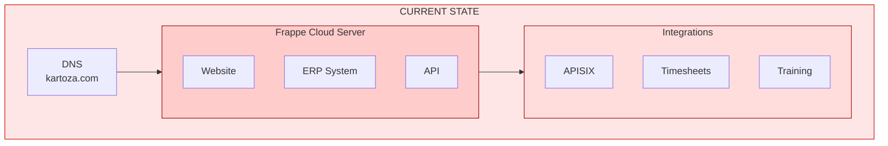
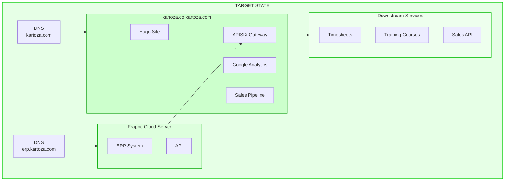
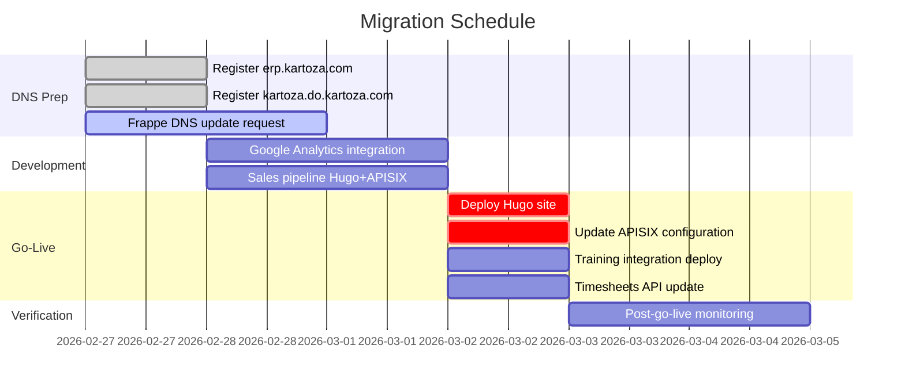
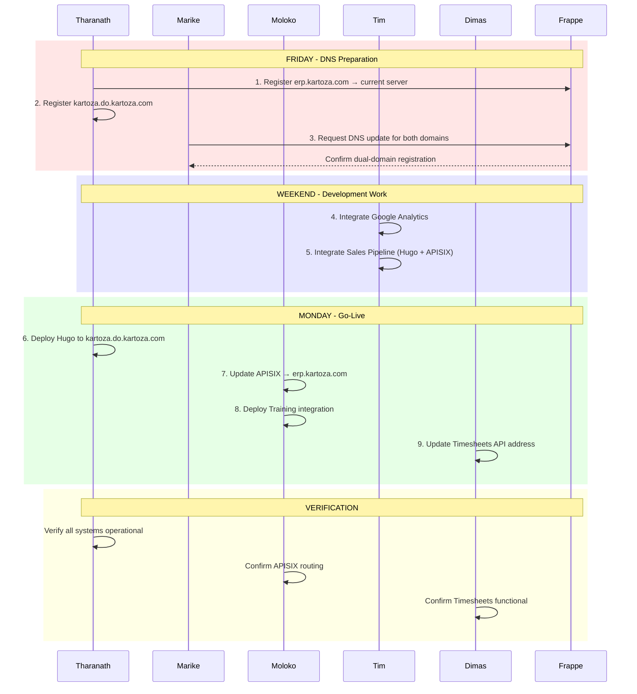
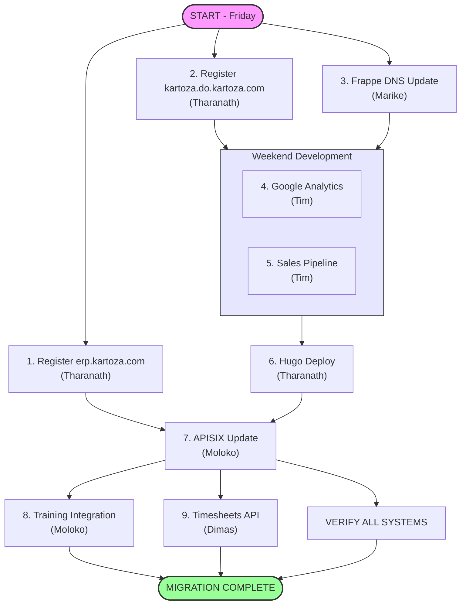
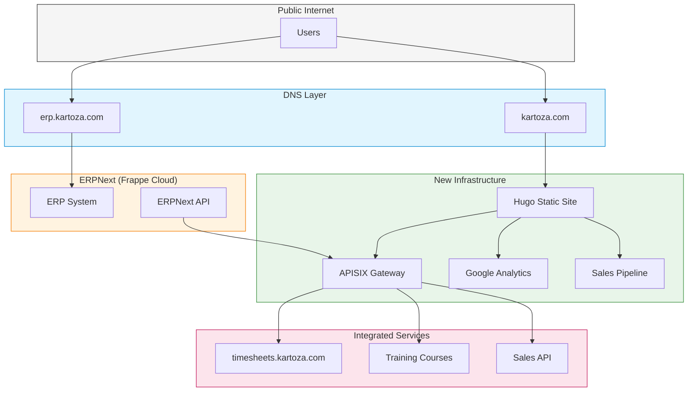
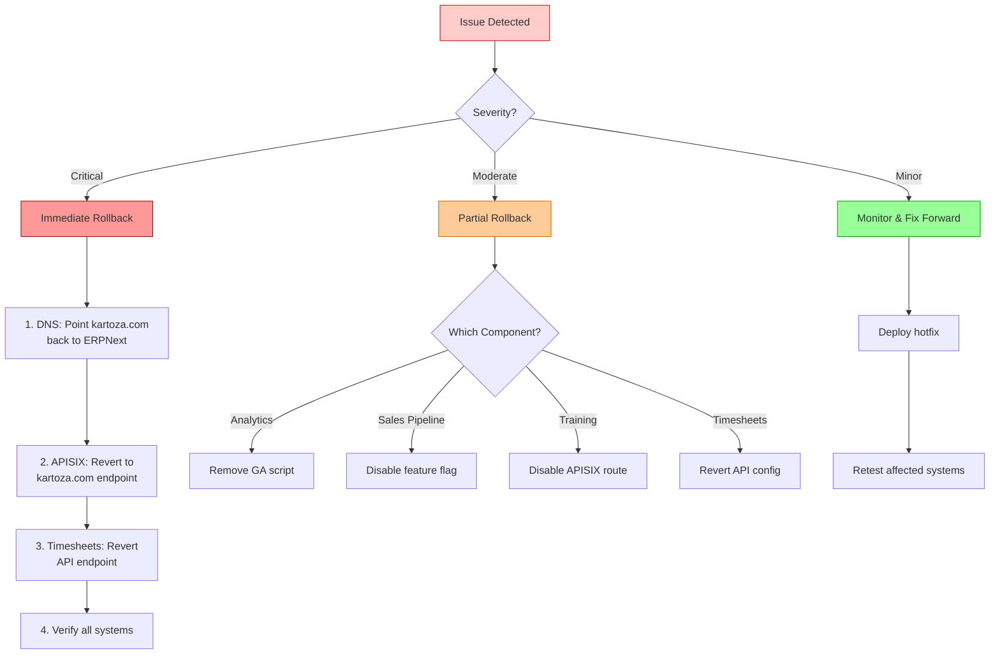
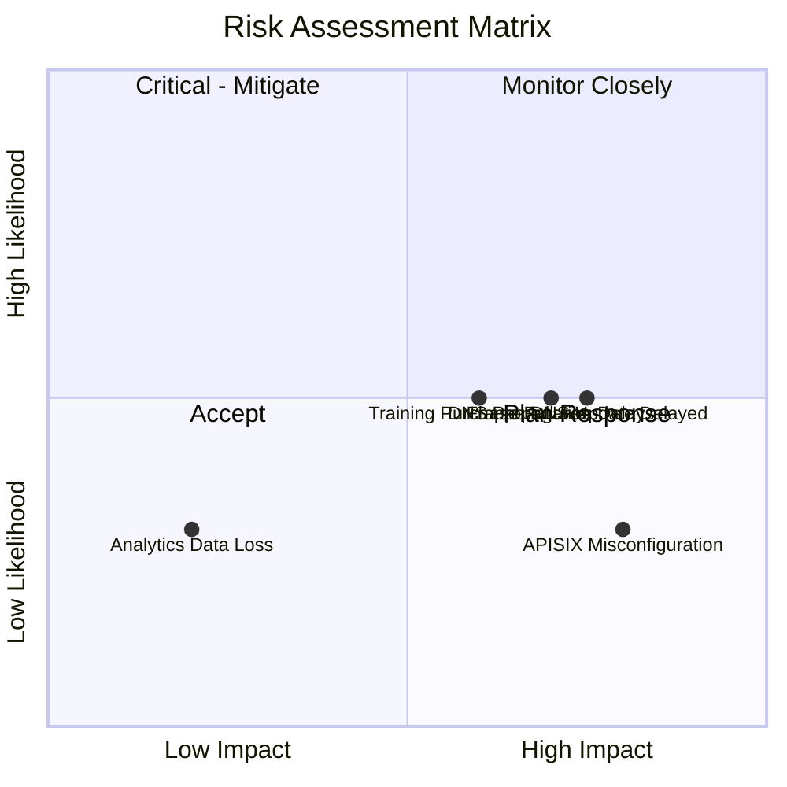

# Kartoza Website Migration Plan

## Executive Summary

This document outlines the migration strategy for transitioning `kartoza.com` from the current ERPNext-hosted website to a new Hugo-based static site, while preserving ERPNext functionality on a dedicated subdomain (`erp.kartoza.com`).

## Current State vs Target State

### Current Architecture

### Target Architecture

## Migration Timeline

## Migration Sequence

## Task Dependencies

## System Integration Architecture

## Detailed Task Breakdown

### Phase 1: DNS Preparation (Friday)

| Task | Owner | Description | Dependencies | Rollback |
|------|-------|-------------|--------------|----------|
| 1.1 | Tharanath | Register `erp.kartoza.com` pointing to current ERPNext server IP | None | Remove DNS record |
| 1.2 | Tharanath | Register `kartoza.do.kartoza.com` with production deployment infrastructure | None | Remove DNS record |
| 1.3 | Marike | Contact Frappe Cloud to update DNS configuration | Task 1.1 | Frappe reverts DNS |

**Frappe DNS Request Details:**
- Reference: https://discuss.frappe.io/t/erpnext-domain-change/159241
- Request both `kartoza.com` AND `erp.kartoza.com` to be registered
- This dual registration enables rollback capability
- Must be completed and verified before Monday

### Phase 2: Development Work (Weekend)

| Task | Owner | Description | Dependencies | Rollback |
|------|-------|-------------|--------------|----------|
| 2.1 | Tim | Integrate Google Analytics into Hugo site | None | Remove GA script |
| 2.2 | Tim | Integrate sales pipeline functionality into Hugo & APISIX | None | Disable feature flag |

### Phase 3: Go-Live (Monday)

| Task | Owner | Description | Dependencies | Rollback |
|------|-------|-------------|--------------|----------|
| 3.1 | Tharanath | Deploy Hugo site to `kartoza.do.kartoza.com` | Phase 1, Phase 2 | Point DNS back to ERPNext |
| 3.2 | Moloko | Update APISIX API configuration to use `erp.kartoza.com` | Task 1.3, 3.1 | Revert APISIX config |
| 3.3 | Moloko | Verify and deploy APISIX integration with training course purchases | Task 3.2 | Disable integration |
| 3.4 | Dimas | Update API address for `timesheets.kartoza.com` | Task 3.2 | Revert API endpoint |

## Rollback Plan

### Rollback Decision Tree

### Rollback Contacts

| Component | Rollback Action | Owner | Time to Rollback |
|-----------|-----------------|-------|------------------|
| DNS | Point `kartoza.com` to ERPNext | Tharanath | ~15 min (propagation) |
| APISIX | Revert configuration | Moloko | ~5 min |
| Google Analytics | Remove tracking script | Tim | ~5 min |
| Sales Pipeline | Disable feature flag | Tim | ~5 min |
| Training Integration | Disable APISIX route | Moloko | ~5 min |
| Timesheet API | Revert endpoint configuration | Dimas | ~5 min |

## Verification Checklist

### Pre-Go-Live (Friday/Weekend)

- [ ] `erp.kartoza.com` resolves to correct IP
- [ ] `kartoza.do.kartoza.com` resolves to deployment server
- [ ] Frappe confirms dual-domain registration
- [ ] Google Analytics integration tested in staging
- [ ] Sales pipeline integration tested in staging

### Go-Live (Monday)

- [ ] Hugo site accessible at `kartoza.com`
- [ ] ERPNext accessible at `erp.kartoza.com`
- [ ] APISIX routing correctly to ERPNext API
- [ ] Training course purchases functional
- [ ] Timesheets API responding correctly
- [ ] Google Analytics receiving data
- [ ] Sales pipeline forms functional

### Post-Go-Live (Tuesday)

- [ ] Monitor error rates in all systems
- [ ] Verify Analytics data collection
- [ ] Confirm all integrations operational
- [ ] User acceptance testing complete

## Risk Assessment

| Risk | Likelihood | Impact | Mitigation |
|------|------------|--------|------------|
| DNS propagation delays | Medium | High | Early DNS changes, low TTL values |
| Frappe DNS update delayed | Medium | High | Dual-domain request allows fallback |
| APISIX misconfiguration | Low | High | Staged rollout, immediate rollback capability |
| Analytics data loss | Low | Low | Verify tracking before go-live |
| Training purchase failures | Medium | Medium | Manual order processing backup |

## Communication Plan

| Stakeholder | Notification | Timing |
|-------------|--------------|--------|
| Internal Staff | Email: Migration timeline and expected changes | Thursday |
| External Users | Website banner: Brief maintenance window | Sunday |
| Support Team | Detailed rollback procedures | Friday |

## Contact Information

| Role | Name | Responsibility |
|------|------|----------------|
| DNS/Infrastructure | Tharanath | DNS records, Hugo deployment |
| Frappe Liaison | Marike | ERPNext domain configuration |
| API Gateway | Moloko | APISIX configuration, training integration |
| Frontend/Analytics | Tim | Hugo site, Google Analytics, sales pipeline |
| Timesheets | Dimas | Timesheet API updates |

---

*Document Version: 1.0*
*Last Updated: 2026-02-27*
*Next Review: Post-migration retrospective*
