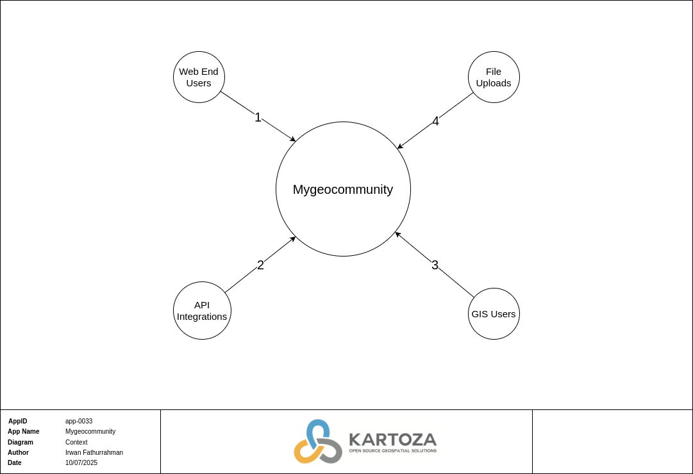
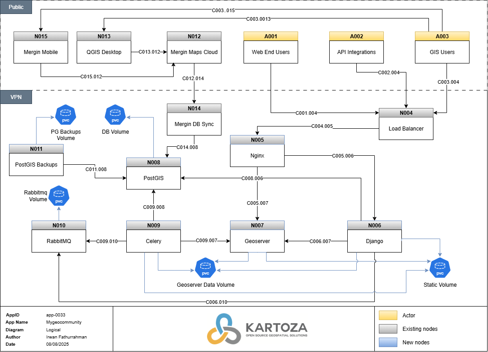
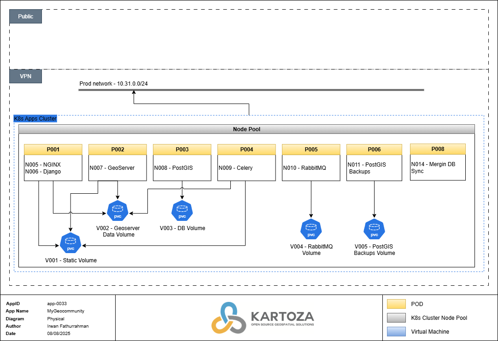

# Solution Design Document:

## Mygeocommunity - App-0033

**Solution Design details:**

 | Item                       | Description        |
 | -------------------------- | ------------------ |
 | **Solution Status**        | Draft              |
 | **App ID**                 | App-0033           |
 | **Approval Date**          |                    |
 | **Review Date**            |                    |
 | **Date of Implementation** |                    |
 | **Author**                 | Irwan Fathurrahman |
 | **Template Version**       | 1.0                |

Table of Contents
=================

- [Solution Design Document:](#solution-design-document)
  - [Mygeocommunity - App-0033](#mygeocommunity---app-0033)
- [Table of Contents](#table-of-contents)
- [1. Introduction](#1-introduction)
  - [1.1 Requirements Overview](#11-requirements-overview)
  - [1.2 Stakeholders](#12-stakeholders)
  - [1.3 Document References](#13-document-references)
- [2. Constraints](#2-constraints)
- [3. System Scope and Context](#3-system-scope-and-context)
- [4. Current Architecture](#4-current-architecture)
  - [4.1 As is Diagram](#41-as-is-diagram)
- [5. Logical Design](#5-logical-design)
  - [5.1 Logical Diagram](#51-logical-diagram)
  - [5.2 Object Descriptions](#52-object-descriptions)
    - [5.2.1 Nodes and Actors](#521-nodes-and-actors)
    - [5.2.2 Volumes](#522-volumes)
- [6. Physical Design](#6-physical-design)
  - [6.1 Physical Design Diagram](#61-physical-design-diagram)
    - [6.1.1 Development](#611-development)
    - [6.1.2 Staging](#612-staging)
    - [6.1.3 Production](#613-production)
  - [6.2 Resource Requirements](#62-resource-requirements)
    - [6.2.1 Kubernetes](#621-kubernetes)
      - [6.2.1.1 Containers](#6211-containers)
      - [6.2.1.1 Volumes](#6211-volumes)
    - [6.2.2 Virtual Machines](#622-virtual-machines)
  - [6.3 Network Requirements](#63-network-requirements)
    - [6.3.1 Application Interfaces](#631-application-interfaces)
    - [6.3.2 Bandwidth](#632-bandwidth)
    - [6.3.3 Certificates](#633-certificates)
- [7. SDLC](#7-sdlc)
  - [7.1 SDLC Flow](#71-sdlc-flow)
  - [7.2 Application Repositories](#72-application-repositories)
  - [7.3 Container Images](#73-container-images)
- [8. High-Level Deliverables](#8-high-level-deliverables)
- [9. User Access Management](#9-user-access-management)
  - [9.1 Authentication](#91-authentication)
  - [9.2 Authorization](#92-authorization)
- [10. Observability](#10-observability)
  - [10.1 Monitoring and Alerting](#101-monitoring-and-alerting)
  - [10.2 Auditing](#102-auditing)
  - [10.3 Logging](#103-logging)
- [11. Architectural Decisions](#11-architectural-decisions)
- [12. Risks and Technical Debt](#12-risks-and-technical-debt)
- [13. Security](#13-security)
  - [13.1 Data Encryption](#131-data-encryption)
  - [13.2 Patching](#132-patching)
- [14. Backups](#14-backups)
- [15. Disaster Recovery](#15-disaster-recovery)

# 1. Introduction

The purpose of the MyGeoCommunity Portal is to provide a platform for geospatial community members to
share, explore, and learn from each other's geospatial content. The Portal is built on the GeoNode Geospatial 
Content Management System, thus the solution will be centered around Geonode.

## 1.1 Requirements Overview

| ID  | Functionality  | Description                                        |
| --- | -------------- | -------------------------------------------------- |
| R1  | Data Storage   | Store geospatial data in PostgreSQL/PostGIS        |
| R2  | Data Serving   | Serve geospatial data through GeoServer            |
| R3  | User Interface | Provide a web-based interface for data interaction |

Table: 1.1 - High-level requirements

## 1.2 Stakeholders

| Role         | Description                                                       |
| ------------ | ----------------------------------------------------------------- |
| DevOps       | Responsible for infrastructure and application deployment.        |
| GIS Team     | Responsible for handling GIS aspect, such as layers.              |
| Development  | Developers will be responsible for application changes if needed. |
| Testing Team | Test application functionality after migration.                   |
| Client       | Application end-user.                                             |
| PMO          | Planning and client communication.                                |

Table: 1.2 - Stakeholders

## 1.3 Document References

| Document         | Description                        | Reference                                        |
| ---------------- | ---------------------------------- | ------------------------------------------------ |
| GeoNode Docs     | GeoNode official documentation     | [GeoNode Docs](https://docs.geonode.org)         |
| Mergin Maps Docs | Mergin maps official documentation | [Mergin Maps Docs](https://merginmaps.com/docs/) |

Table: 1.3 - Document references

# 2. Constraints

| Constraint                        | Description                                                                                                 |
| --------------------------------- | ----------------------------------------------------------------------------------------------------------- |
| Deployment Platform               | There is an existing company policy enforcing Kubernetes as the deployment platform.                        |
| Data Storage Requirements         | Must use PostgreSQL/PostGIS for geospatial data storage due to its advanced spatial data capabilities.      |
| Security Compliance               | Must adhere to specific security standards and regulations, such as GDPR, for handling geospatial data.     |
| Integration with Legacy Systems   | Must integrate with existing legacy systems and databases, which may limit the choice of technologies.      |
| Performance Requirements          | Must meet specific performance criteria for handling large volumes of geospatial data and concurrent users. |
| Availability Requirements         | Must ensure high availability and disaster recovery capabilities for critical geospatial data services.     |
| Resource Constraints              | Limited in-house expertise and resources for certain technologies, requiring reliance on existing skills.   |
| User Access Control               | Must implement strict user access control mechanisms to protect sensitive geospatial data.                  |
| Maintenance and Support           | Solutions must be maintainable and supported over the long term, with clear upgrade and patching paths.     |
| Compatibility with Open Standards | Must comply with open standards for geospatial data formats and services, such as OGC standards.            |
| Environmental Considerations      | Must consider the environmental impact of the infrastructure, promoting energy-efficient solutions.         |
| Backup and Recovery Policies      | Must adhere to established backup and recovery policies to ensure data integrity and availability.          |

Table: 2.1 - Constraints

# 3. System Scope and Context

| Connection | Description                                                                   |
| ---------- | ----------------------------------------------------------------------------- |
| 1          | Public Web Users accessing Mygeocommunity through the web interface or CLI.   |
| 2          | External services accessing Mygeocommunity APIs for geospatial data.          |
| 3          | Internal GIS users accessing the Mygeocommunity system via the web interface. |
| 4          | Users who have file manager permission can upload file.                       |

*Table: 3.1 - Context connections*

# 4. Current Architecture

## 4.1 As is Diagram
N/A

# 5. Logical Design

## 5.1 Logical Diagram

## 5.2 Object Descriptions

### 5.2.1 Nodes and Actors

| Node | Description                                                                    |
| ---- | ------------------------------------------------------------------------------ |
| A001 | Users accessing the website interface.                                         |
| A002 | API integrations to Mygeocommunity.                                            |
| A003 | GIS users accessing GeoServer and GeoNode.                                     |
| N004 | External load balancer (DigitalOcean).                                         |
| N005 | NGINX service for routing traffic to internal services.                        |
| N006 | Geonode web application.                                                       |
| N007 | Geoserver web application.                                                     |
| N008 | PostgreSQL with PostGIS extension, used as the database.                       |
| N009 | Celery worker.                                                                 |
| N010 | RabbitMQ application used as a Celery broker.                                  |
| N011 | PostGIS Backup service, used to routinely create backups of the database N008. |
| N012 | Kartoza Mergin Maps Cloud Server.                                              |
| N013 | QGIS Desktop running on a GIS user's machine.                                  |
| N014 | Mergin DB sync daemon.                                                         |
| N015 | Mergin maps mobile application.                                                |

Table: 5.1 - Nodes and Actors

### 5.2.2 Volumes

| Name                   | Description                                |
| ---------------------- | ------------------------------------------ |
| Static Volume          | Shared static data volume.                 |
| Geoserver Data Volume  | Volume contains geoserver configurations.  |
| DB Volume              | Database data volume.                      |
| RabbitMQ Volume        | Message broker data volume.                |
| PostGIS Backups Volume | Stores automated PostGIS database backups. |

Table: 5.2 - System Data volumes

# 6. Physical Design

## 6.1 Physical Design Diagram

### 6.1.1 Development
N/A - Not needed for this solution.

### 6.1.2 Staging
N/A - Not needed for this solution.

### 6.1.3 Production

## 6.2 Resource Requirements

### 6.2.1 Kubernetes

#### 6.2.1.1 Containers

| Environment | Container | CPU | Memory |
| ----------- | --------- | --- | ------ |
| PRD         | N005      | 0.5 | 100 Mi |
| PRD         | N006      | 1.5 | 2.0 Gi |
| PRD         | N007      | 1   | 5.5 Gi |
| PRD         | N008      | 1   | 2.0 Gi |
| PRD         | N009      | 0.5 | 1.5 Gi |
| PRD         | N010      | 0.5 | 200 Mi |
| PRD         | N011      | 0.5 | 50 Mi  |
| PRD         | N014      | 0.5 | 50 Mi  |

Table: 6.1 - Kubernetes service resource requirements

#### 6.2.1.1 Volumes

| Environment | Volume | Mode | Size  |
| ----------- | ------ | ---- | ----- |
| PRD         | V001   | RWX  | 100GB |
| PRD         | V002   | RWX  | 75GB  |
| PRD         | V003   | RWO  | 25GB  |
| PRD         | V004   | RWO  | 2GB   |
| PRD         | V005   | RWO  | 40GB  |

Table: 6.2 - Volume requirements

### 6.2.2 Virtual Machines

N/A

## 6.3 Network Requirements

### 6.3.1 Application Interfaces

| Connection | Source | Target | Protocol | Port |
| ---------- | ------ | ------ | -------- | ---- |
| C001.004   | A001   | N004   | HTTPS    | 443  |
| C002.004   | A002   | N004   | HTTPS    | 443  |
| C003.004   | A003   | N004   | HTTPS    | 443  |
| C003.0013  | A001   | N012   | HTTPS    | 443  |
| C003.015   | N015   | N012   | HTTPS    | 443  |
| C004.005   | N004   | N005   | TCP      | 8080 |
| C005.006   | N005   | N006   | TCP      | 8000 |
| C005.007   | N005   | N007   | TCP      | 8080 |
| C006.007   | N006   | N007   | TCP      | 8080 |
| C006.008   | N006   | N008   | TCP      | 5432 |
| C006.010   | N006   | N010   | AMQP     | 5672 |
| C009.007   | N009   | N007   | TCP      | 8080 |
| C009.008   | N009   | N008   | TCP      | 5432 |
| C009.010   | N009   | N010   | AMQP     | 5672 |
| C011.008   | N011   | N008   | TCP      | 5432 |
| C012.014   | N012   | N014   | HTTPS    | 443  |
| C013.012   | N013   | N012   | HTTPS    | 443  |
| C014.008   | N014   | N008   | TCP      | 5432 |

Table: 6.4 - Application Interfaces

### 6.3.2 Bandwidth

Mygeocommunity requires sufficient bandwidth to handle multiple concurrent users
accessing and downloading geospatial data.

### 6.3.3 Certificates

| Environment | Service | Certificate Type | Domain             |
| ----------- | ------- | ---------------- | ------------------ |
| PRD         | Django  | Public           | mygeocommunity.org |

*Table: 6.5 - Certificates*

# 7. SDLC

## 7.1 SDLC Flow

There is currently no SDLC flow defined for this solution.

Table: 7.1 - SDLC Flow

## 7.2 Application Repositories

| Name            | Repo Code | Purpose                                              | Link                                               |
| --------------- | --------- | ---------------------------------------------------- | -------------------------------------------------- |
| GeoNode Project | R001      | Contains GeoNode project settings and configurations | [Link](https://github.com/kartoza/geonode-project) |

Table: 7.2 - Application repositories

## 7.3 Container Images

| Service No | Repo Code | SDLC Build | Image Name                     | Tag                    | Dockerfile Path |
| ---------- | --------- | ---------- | ------------------------------ | ---------------------- | --------------- |
| N005       | -         | No         | nginx                          | 1.25.1-alpine          | -               |
| N006       | R001      | No         | kartoza/geonode                | v4.1.x                 |                 |
| N007       | -         | No         | kartoza/geoserver              | 2.24.4-geo-v2024.08.15 | -               |
| N008       | -         | No         | kartoza/postgis                | 14-3.3                 | -               |
| N009       | R001      | No         | kartoza/geonode                | v4.1.x                 |                 |
| N010       | -         | No         | rabbitsmq                      | 3.7-alpine             | -               |
| N011       | -         | No         | kartoza/pg-backup              | 14-3.2                 | -               |
| N014       | -         | No         | lutraconsulting/mergin-db-sync | latest                 | -               |

Table: 7.3 - Container images

# 8. High-Level Deliverables

| Item                            | Description                                           | Responsible      |
| ------------------------------- | ----------------------------------------------------- | ---------------- |
| Development of MVP application  | Application development for MVP.                      | Developer        |
| Finalize SDD                    | Developer and DevOps create SDD in collaborative way. | Developer/DevOps |
| Infrastructure provisioning     | Review and update cloud infrastructure as needed.     | DevOps           |
| Deployment configuration        | The k8s deployment needs to be developed and tested.  | DevOps           |
| PRD deployment planning         | Define the production configuration.                  | PMO              |
| PRD infrastructure provisioning | Provision the PRD environment.                        | DevOps           |
| PRD deployment                  | Deploy to production.                                 | DevOps           |
| PRD testing                     | Test application on production.                       | Developer/Tester |

Table: 8.1 - High-level deliverables

# 9. User Access Management

| Role         | Description                            |
| ------------ | -------------------------------------- |
| Admin user   | Django admin user.                     |
| File manager | User who will be able to upload files. |
| User         | User who will use application.         |

Table: 9.1 - User types

## 9.1 Authentication

| Role         | IdP   | Comment |
| ------------ | ----- | ------- |
| Admin user   | Local |         |
| File manager | Local |         |
| User         | Local |         |

Table: 9.2 - Authentication

## 9.2 Authorization

| Role         | Comment                                    |
| ------------ | ------------------------------------------ |
| Admin User   | User who has is_superuser enabled.         |
| File manager | User who has access to file manager group. |
| User         | Regular user who will use application.     |

Table: 9.3 - Authorization

# 10. Observability

## 10.1 Monitoring and Alerting
We have the following monitoring requirements:

Kartoza systems:
* Uptime monitoring of the web interface.
* Database monitoring.
* Kubernetes resource metrics.
* Sentry observations.

## 10.2 Auditing

Auditing should cover user access logs, configuration changes, and data
modification logs to ensure accountability and traceability.

## 10.3 Logging

Logging should include application logs, system logs, and access logs. These
should be stored securely and be accessible for troubleshooting and audit
purposes. Solution logs are currently being shipped to Loki.

# 11. Architectural Decisions

None identified for this solution.

# 12. Risks and Technical Debt

# 13. Security

## 13.1 Data Encryption

All sensitive data must be encrypted at rest and in transit. This includes
database encryption and the use of HTTPS for all web traffic.

## 13.2 Patching

Regular patching schedules should be established, and critical patches must be
applied immediately. Automation tools should be used where possible to ensure
timely updates.

# 14. Backups

- Regular backups of the PostgreSQL/PostGIS database will be managed by the PostGIS Backups service.
- Cluster backups are managed by Velero. Daily backups are required that will include the volumes.
- Backups should be stored securely and tested periodically for integrity.

# 15. Disaster Recovery

- Production disaster recovery requirements to be defined by the project team.
- We will be able to restore the database to the last archived PostGIS Backup file. 
- The application can be recovered in the event of a disaster by restoring from the latest Velero backup. This however means that we will lose data for up to 24 hours.
